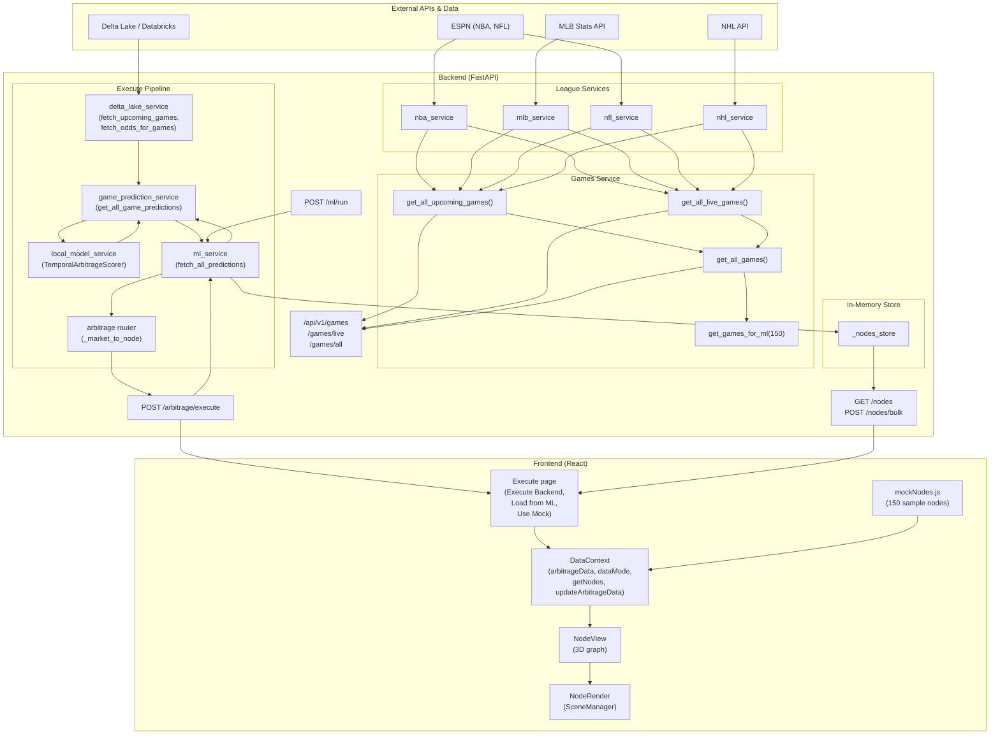

## Data flow

### Flow summary

| Stage | What happens |
|-------|----------------|
| **1. Games** | League services (NBA, MLB, NFL, NHL) fetch from ESPN / MLB / NHL APIs. `games_service` aggregates them and can select up to 150 games evenly per sport for ML (`get_games_for_ml`). Exposed as `GET /games`, `/games/live`, `/games/all`. |
| **2. Execute pipeline** | **Execute Backend** triggers `POST /arbitrage/execute`. Backend calls `fetch_all_predictions()` → `game_prediction_service.get_all_game_predictions()` which pulls **games + odds** from Delta Lake (or sample fallback), runs the **local ML model** (TemporalArbitrageScorer) per game × market, then the arbitrage router converts each market to a **node** (profit_score, risk_score, confidence, etc.). Returns a flat list of nodes to the frontend. |
| **3. ML run (optional)** | `POST /ml/run` runs the same prediction pipeline and can **append** results to the in-memory nodes store. |
| **4. Nodes store** | In-memory `_nodes_store` is filled by `POST /ml/run?store=true` or `POST /nodes/bulk`. `GET /nodes` returns the current list. **Load from ML** in the frontend calls `GET /nodes` and loads that list into the app. |
| **5. Frontend** | **Execute Backend** → `POST /arbitrage/execute` → nodes → `updateArbitrageData(nodes)` (live mode). **Load from ML** → `GET /nodes` → `updateArbitrageData(nodes)`. **Use Mock** → `resetToMock()` so `getNodes()` returns built-in mock data. NodeView reads `getNodes()` from DataContext and passes them to NodeRender (3D scene). |

Everything is synchronous per request: the backend waits for games, then Delta Lake/odds, then local ML, then returns nodes. The frontend waits for the API response before updating the graph.

---